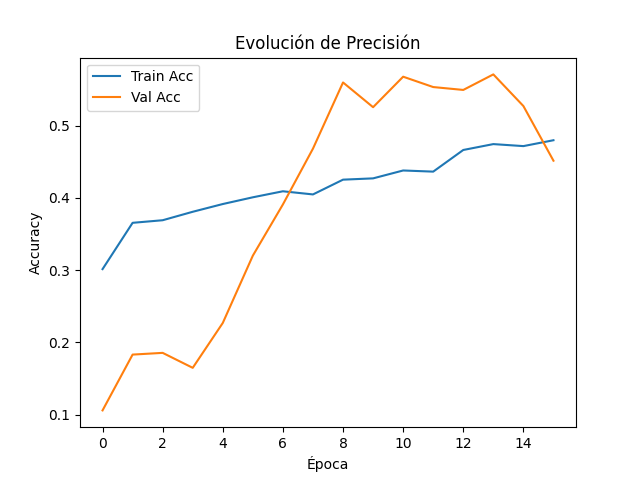
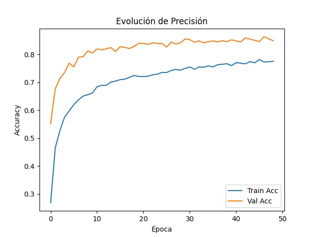
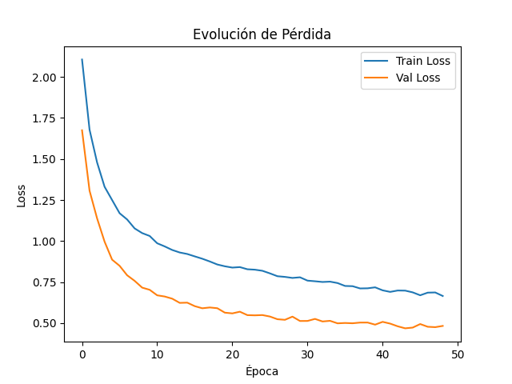

# SportImageClassifier

**Enunciado del problema**  
Clasificar automáticamente imágenes de distintas disciplinas deportivas (fútbol, baloncesto, boxeo, ajedrez, etc.) para su uso en plataformas de transmisión y generación de estadísticas en tiempo real.

**Resumen de métodos (CNN y Transfer Learning)**  
Se implementaron dos enfoques para la clasificación de imágenes deportivas:

1. **CNN desde cero**  
   – Arquitectura propia con 3 bloques de Convolución → BatchNorm → MaxPooling → Dropout (filtros 32, 64, 128), seguido de Flatten y Dense(256) + Dropout + softmax.  
   – Entrenada con Adam, *learning rate* ajustable, y *early stopping* para detener el entrenamiento cuando la validación deja de mejorar.

2. **Transfer Learning (VGG16)**  
   – Se utilizó la base de VGG16 preentrenada en ImageNet, congelando sus capas convolucionales para preservar las características aprendidas.  
   – Sobre esa base se añadió un bloque de GlobalAveragePooling → Dense(256) + Dropout → softmax, y se entrenó únicamente esa “cabeza” para adaptar el modelo a las clases deportivas citeturn0file0.  

**Código utilizado (extractos clave)**  

<details>
<summary>1. Definición de la CNN desde cero (<code>models.py</code>)</summary>

```python
def build_cnn_model(input_shape, num_classes, learning_rate=1e-3):
    model = Sequential([
        Conv2D(32, (3,3), activation='relu', padding='same', input_shape=input_shape),
        BatchNormalization(), MaxPooling2D(), Dropout(0.25),
        Conv2D(64, (3,3), activation='relu', padding='same'),
        BatchNormalization(), MaxPooling2D(), Dropout(0.25),
        Conv2D(128,(3,3),activation='relu',padding='same'),
        BatchNormalization(), MaxPooling2D(), Dropout(0.25),
        Flatten(),
        Dense(256, activation='relu'), Dropout(0.5),
        Dense(num_classes, activation='softmax')
    ])
    model.compile(optimizer=Adam(learning_rate),
                  loss='categorical_crossentropy',
                  metrics=['accuracy'])
    return model
```
</details>

<details>
<summary>2. Definición del modelo con Transfer Learning (VGG16)</summary>

```python
def build_transfer_model(input_shape, num_classes, learning_rate=1e-3):
    base = VGG16(include_top=False, weights='imagenet', input_shape=input_shape)
    for layer in base.layers:
        layer.trainable = False

    x = base.output
    x = GlobalAveragePooling2D()(x)
    x = Dense(256, activation='relu')(x)
    x = Dropout(0.5)(x)
    out = Dense(num_classes, activation='softmax')(x)

    model = Model(inputs=base.input, outputs=out)
    model.compile(optimizer=Adam(learning_rate),
                  loss='categorical_crossentropy',
                  metrics=['accuracy'])
    return model
```
</details>

<details>
<summary>3. Selección de modelo en <code>main.py</code></summary>

```python
# …
if args.model == 'cnn':
    model = build_cnn_model(input_shape, num_classes, learning_rate=args.learning_rate)
    model_path = os.path.join(args.output, 'cnn_model.keras')
else:
    model = build_transfer_model(input_shape, num_classes, learning_rate=args.learning_rate)
    model_path = os.path.join(args.output, 'transfer_model.keras')
# …
```
</details>

**Resultados (CNN y Transfer Learning)**  


*Figura 1. Curva de Precisión (CNN)*


*Figura 2. Curva de Pérdida (CNN)*


*Figura 3. Curva de Precisión (Transfer Learning)*


*Figura 4. Curva de Pérdida (Transfer Learning)*

| Modelo           | LR     | Épocas | Batch | # Conv | Val. Accuracy |
|:----------------:|:------:|:------:|:-----:|:------:|:-------------:|
| CNN              | 0.0005 | 100    | 64    | 3      | 0.3607        |
| Transfer Learning| 0.0005 | 50     | 32    | N/A    | 0.8123        |

> **Nota:** Transfer Learning con VGG16 mostró un desempeño significativamente superior, alcanzando ∼81 % de precisión en validación, en comparación con el modelo CNN desde cero.

**Predicciones de los modelos**

*Predicciones CNN:*

|  |  |  |  |  |  |  |  |  |  | 

*Predicciones Transfer Learning:*

|  |  |  |  |  |  |  |  |  |  |

**Conclusiones y observaciones**  
- El CNN desde cero mostró limitaciones (∼36 % val. accuracy) en clases visualmente similares.  
- **Transfer Learning** con VGG16 (o ResNet50) suele mejorar notablemente la precisión y acelerar la convergencia.  
- Ajustar hiperparámetros (capas, filtros, LR scheduling) y ampliar data augmentation puede ayudar.  
- Se recomienda evaluar y comparar ambos enfoques (scratch vs. transfer) cuantitativamente.

**Referencias**  
- Práctica 2: Redes Neuronales Convolucionales. Univ. de Guadalajara citeturn0file0  
- Chollet, F. *Deep Learning with Python*. Manning, 2017.  
- “Transfer Learning using CNN (VGG16)”. Turing citeturn0search5

## Entrenar el modelo CNN desde cero:
```
python main.py --model cnn --dataset dataset --epochs 20 --batch_size 32 --learning_rate 0.001 --output models
```

## Para entrenar con Transfer Learning:
```
python main.py --model transfer --dataset dataset --epochs 20 --batch_size 32 --learning_rate 0.001 --output models
```

python main.py --model cnn --dataset dataset --epochs 100 --batch_size 64 --learning_rate 0.0005 --output models

## Evaluación del Modelo:
Una vez entrenado el modelo, evalúalo con:
```
python evaluate.py --model_path models/cnn_model.keras --dataset dataset
```

## Predicción de una Imagen Individual:
Para probar una imagen específica:
```
python predict.py --model_path models/cnn_model.keras --image single_test/imagen.jpg --dataset dataset
```

## Predicción en Lote (batch_predict):
Para recorrer y predecir todas las imágenes en la carpeta `single_test`:

### CNN
```
python batch_predict.py --model_path models/cnn_model.keras --model_name cnn --test_folder single_test --dataset dataset --target_size 128 --results_dir results
```

### Transfer learning
```
python batch_predict.py --model_path models/transfer_model.keras --model_name transfer --test_folder single_test --dataset dataset --target_size 128 --results_dir results
```
